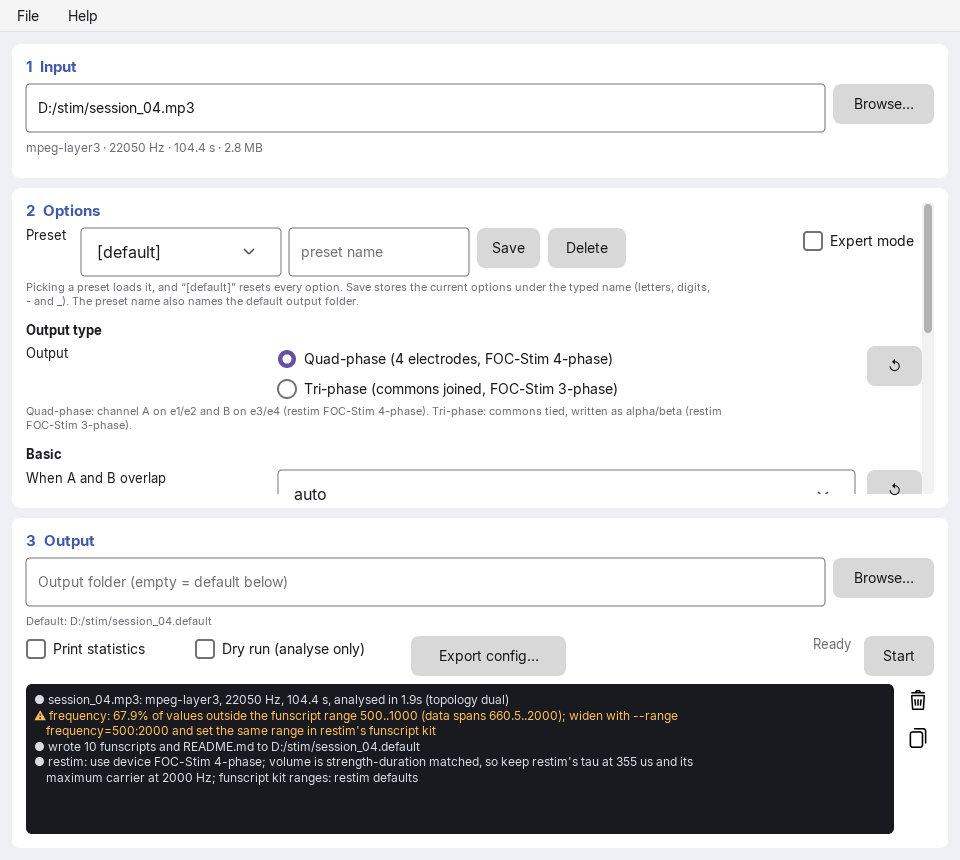
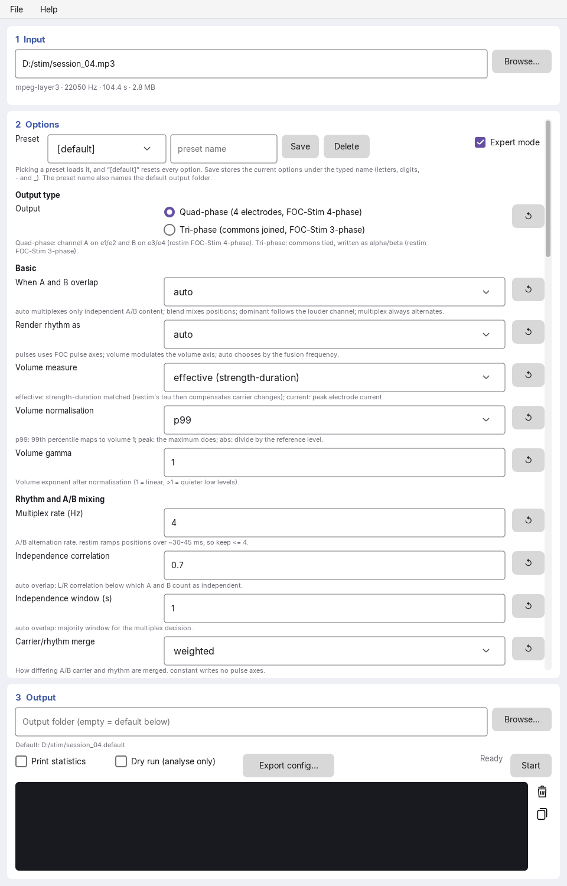
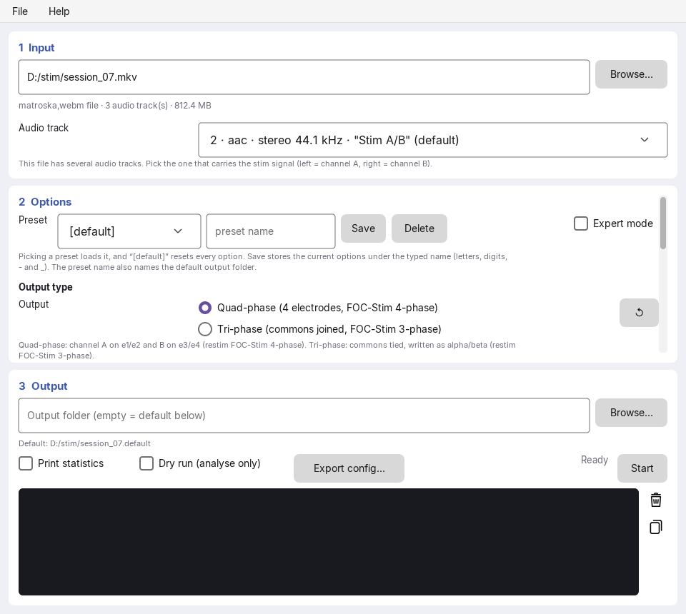
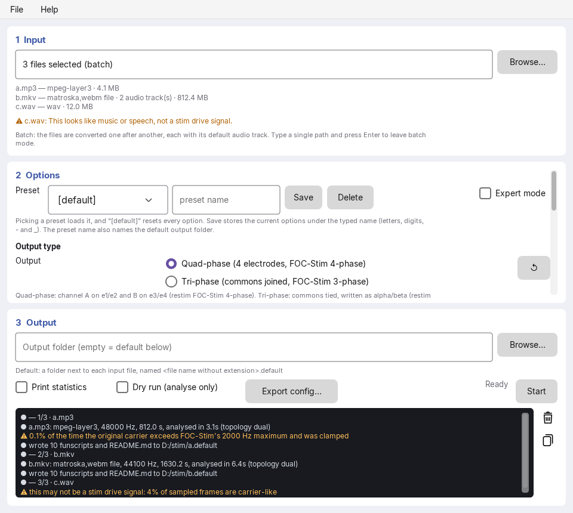

# stimconv

stimconv converts audio drive signals for 2-channel audio-amplifier stim boxes
into a restim funscript set for FOC-Stim v4. It aims for a similar electrical
stimulus, not a similar sound: the audio is treated as amplifier voltage, run
through a model of the original hardware, and analysed as estimated electrode
current.

> [!WARNING]
> Use this software entirely at your own risk. It generates control signals
> for electrical stimulation hardware and comes with no warranty of any kind.
> You are solely responsible for verifying its output and for how you use it.
> The authors accept no liability for any harm, injury or damage arising from
> the software, its use, or the use of the files it produces. It is not a
> medical device.
>
> stimconv is not under (very) active development, so while issues and feature
> requests are always welcome, they may not be implemented any time soon.
> If you need changes, you are strongly encouraged to fork the 
> project, make the changes, and file a pull request. For obvious reasons LLM 
> generated code will be accepted, provided you do your own code review and tests
> and document these in the merge/pull request.
>

<a href="docs/images/main.png"></a>

## Highlights

- **Quad-phase and tri-phase output.** `dual` maps channel A to e1/e2 and B to
  e3/e4 for FOC-Stim 4-phase. `joined` ties the commons and writes alpha/beta
  for FOC-Stim 3-phase, using restim's own inverse transform.
- **Hardware model.** A circuit simulation of the original box (amplifier,
  line transformer, skin impedance) turns the audio into estimated electrode
  current before analysis.
- **Per-channel analysis.** Carrier frequency, waveform form factor, envelope,
  rhythm (rate, duty, attack, jitter) and A/B covariance.
- **Explicit A/B strategies.** FOC-Stim has one carrier and one pulse train.
  Every rule for resolving A/B conflicts (overlap, parameter merge, rhythm
  rendering, interferential beat) can be selected.
- **Volume as recorded, or normalized.** By default the volume follows the
  recorded peak level as-is. The `*-normalized` presets scale each track to the
  full range instead, with strength-duration matched intensity that stays
  consistent with restim's tau calibration.
- **FOC-Stim limits enforced.** Carrier 300–2000 Hz, pulse rate 1–100 Hz,
  width 3–20 cycles (at most 35 ms), rise 2–10 cycles. Out-of-range data is
  reported, with suggested funscript kit ranges.
- **Broad input support.** MPEG Layer II, FLAC and WAV decode natively. MPEG
  Layer III, video containers and other formats go through a bundled LGPL
  FFmpeg build.
- **Reproducible runs.** Every conversion writes a settings report next to the
  funscripts, and every option can be saved as a preset or JSON config.

## Graphical interface

Run `stimconv` without arguments. The window follows the conversion: input,
options, output.

After you pick a file, a line under its name says whether it looks like a stim
drive signal (or warns when it looks like music or speech), and, after a
background pass over the whole file, whether it was likely made for tri-phase
(the phase between A and B carries position) or quad-phase (A and B carry
separate content), and which preset fits.

### Options and presets

Beginners see the output type and a few basic options. **Expert mode** shows
every setting, grouped, each with a short explanation and a reset button.
Six built-in presets cover the common cases: `[tri-original]` (the
default) and `[quad-original]` reproduce the recorded level as-is,
`[tri-original-smooth]` does so without imitating the beat between different
carriers, `[quad-normalized]` / `[tri-normalized]` scale every track to
the full volume range, and `[mono-original]` plays a mono track the way the
original box did, on one channel: two electrodes, on FOC-Stim outputs A and B
(output C stays unconnected) (CLI: `--preset tri-original`). Your own presets are
stored as `--config`-compatible JSON. The funscripts are written next to the
input; tick **Write to a sub-folder** (CLI `--subfolder`) for a folder
`<input name>`, and **Add preset to folder name** (`--preset-suffix`) for
`<input name>.<preset>`. Funscripts left by an earlier run with other options
(e.g. `e1`–`e4` after switching to tri-phase) are removed. Before
overwriting or deleting any existing file, the GUI asks; the CLI aborts unless
`--overwrite-files` is given.

<a href="docs/images/expert.png"></a>

### Video files and audio tracks

Video containers (mkv, mp4, ...) are supported. When a file has several audio
tracks, a selector appears with the default track preselected. For tracks
with more than two channels, the first two are used as A and B without being
downmixed.

<a href="docs/images/tracks.png"></a>

### Batch conversion

Select or drop several files to convert them in one run. Each file uses its
default audio track and its own output folder. A failure does not stop the
batch. Inputs that look like music or speech rather than a drive signal are
flagged as soon as they are selected. This is a warning only and never blocks
conversion. The console marks each line as info, warning or error.

<a href="docs/images/batch.png"></a>

## Command line

```sh
stimconv cli [flags] track.mp3            # writes track/track.<axis>.funscript
stimconv cli --topology joined track.mp3  # tri-phase (alpha/beta)
stimconv cli --stats --dump-features f.csv track.mp3
stimconv cli --list-tracks video.mkv      # list audio tracks
stimconv cli --audio-track 2 video.mkv    # convert the second audio track
stimconv cli --emit-config my.json        # write the effective configuration
stimconv cli --config my.json track.mp3   # flags override the file
```

The CLI prints the restim settings the output assumes. Select **FOC-Stim
4-phase** in restim for `dual` (the default) or **FOC-Stim 3-phase** for
`joined`. If you write output with `--range axis=min:max`, set the same range
in restim's funscript kit.

## Output

Each conversion produces one `.funscript` per axis, simplified with RDP, and a
settings report. The report is named `README.md` in a sub-folder, or
`<input name>.md` next to the input or in a chosen folder. It records the source file and track,
the preset, every option with its value and whether that value is the default,
the files written, warnings and restim hints.

## Building

```sh
go build -o bin/ .
go run ./tools/ffmpeg fetch   # bundled FFmpeg for a development build
go run ./tools/release        # Windows release zip in dist/
go test ./...
```

FFmpeg is located through `--ffmpeg`, `$STIMCONV_FFMPEG`, `libs/ffmpeg/bin` or
`PATH`. See [docs/FFMPEG.md](docs/FFMPEG.md) for the pinned build and the
license notes.

The screenshots in this README are rendered headlessly:

```sh
STIMCONV_README_SHOTS=$PWD/docs/images go test ./internal/gui -run ReadmeShots
```

## Documentation

[docs/](docs/README.md) covers the conversion in depth:

| Topic | Document |
|---|---|
| Problem statement and signal chain | [01](docs/01-problem-and-signal-chain.md) |
| Source material | [02](docs/02-source-material.md) |
| Original hardware model | [03](docs/03-original-hardware-model.md) |
| Analysis | [04](docs/04-analysis.md) |
| restim and FOC-Stim constraints | [05](docs/05-target-restim-focstim.md) |
| Mapping | [06](docs/06-mapping.md) |
| Research basis | [07](docs/07-research-basis.md) |
| Options reference | [08](docs/08-options-reference.md) |
| Validation | [09](docs/09-validation.md) |
| Open issues | [10](docs/10-open-issues.md) |
| User FAQ | [11](docs/11-user-faq.md) |

## Use of AI

Most of the code, tests and documentation in this repository were written
with Claude (Anthropic) through Claude Code. Claude also researched the
reference implementations (restim, FOC-Stim) and the published literature
the mapping rules rely on, and built the synthetic tests and decoder
validation.

As the author I primarily set the goals and the architecture, made the design 
decisions, supplied the analysis of the original hardware (schematic and sample
tracks), audited Claude's code and documentation to the best of their
ability, and tested the output on FOC-Stim hardware.

What's interesting is that initially I intended to use Claude only to lay out
the boiletplate code (ie the GUI and basic app architecture), but, it did an
excellent job in applying its research findings to the application.

The extensive documentation in [docs/](docs/README.md) exists partly for this
reason: it records the reasoning behind each decision, including Claude's, so
that humans can understand, check and challenge it.

## License

stimconv is released under [MIT No Attribution](LICENSE) (MIT-0): do anything
with it, no attribution required, no warranty and no liability. Third-party
components keep their own licenses (MIT, BSD, Apache 2.0, public domain, SIL
OFL for the Inter font, and LGPL for the separately bundled FFmpeg); see Help →
About and [docs/FFMPEG.md](docs/FFMPEG.md).
